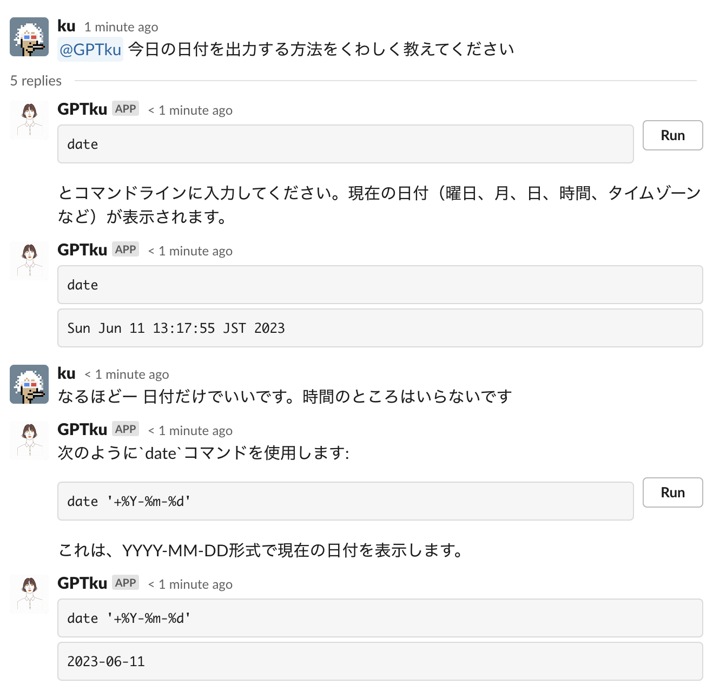

chatbot
=======

Slackbot for testing openai chat completion.
Do something on the response and print the result in the thread.
Supports both Slack webhook and websocket mode.

```
Usage:
  chatbot [flags]

Flags:
  -c, --chat string           chat service [websocket|webhook] (default "websocket")
  -h, --help                  help for chatbot
  -l, --llm string            llm service [openai|echo] (default "echo")
  -m, --messagestore string   messagestore [memory|spanner] (default "memory")
```


